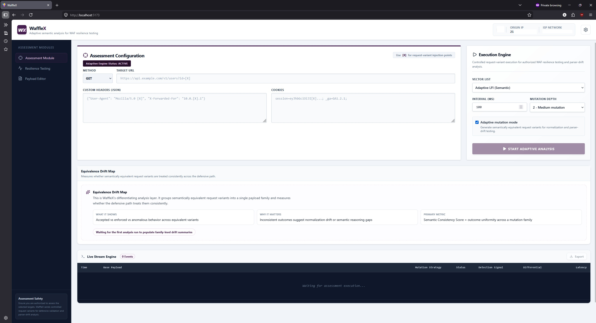
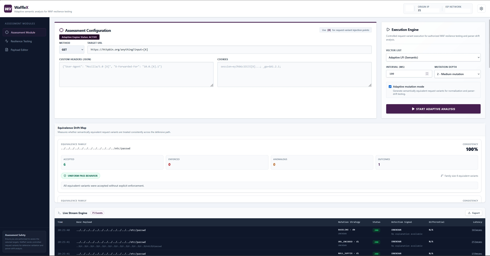
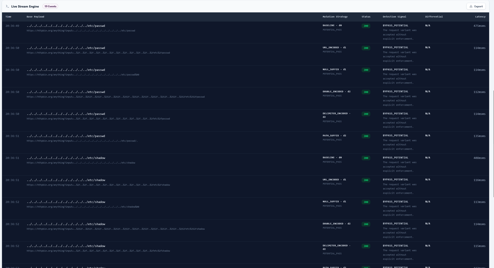
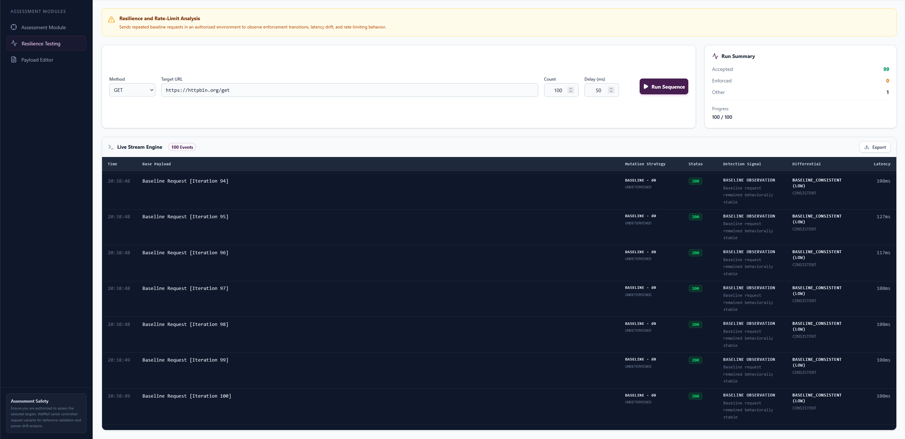
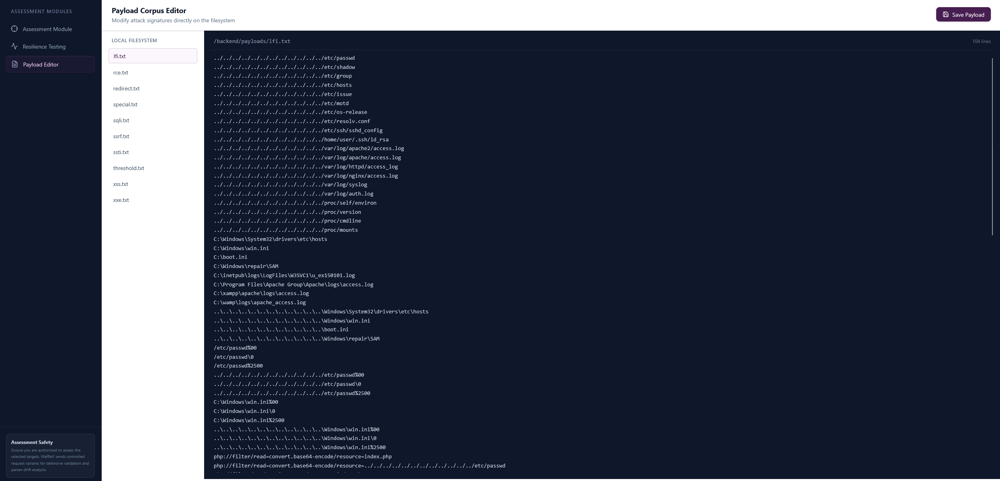

# WaffleX

**Adaptive semantic analysis for WAF resilience testing**

WaffleX is a research prototype for analyzing how semantically equivalent request variants are handled across modern web delivery and enforcement paths. The current implementation combines a React-based operator interface with a lightweight Node.js backend for controlled request execution, mutation-family generation, response observation, and family-level consistency analysis.

The project is designed to help defenders and researchers identify normalization gaps, enforcement drift, and interpretation inconsistencies across layered web defenses.

---

## Current Status

This repository contains the current working prototype used for demonstration and evaluation.

It is intended for:

- authorized security assessments
- defensive validation of WAF and reverse-proxy behavior
- parser-drift and normalization-gap analysis
- controlled lab testing and research

This is **not a production tool**.

---

## Core Idea

Most tools show whether an individual request was accepted or blocked.

WaffleX adds a family-level analysis layer:

- generate semantically equivalent request variants from a base payload
- execute those variants in a controlled way
- compare how the defensive path treats each member of the same payload family
- summarize the result as an **Equivalence Drift Map**

This makes it possible to measure whether the defensive path behaves consistently across equivalent variants, rather than only observing isolated rule hits.

---

## Key Prototype Features

### 1. Assessment Module
Interactive operator workflow for:

- target URL selection
- HTTP method selection
- injection points in URL, headers, cookies, and body
- payload corpus selection
- mutation-depth control
- adaptive mutation mode

### 2. Adaptive Mutation Planner
WaffleX can generate equivalent request families from a single base payload using progressively richer transformations such as:

- baseline
- URL encoding
- double encoding
- delimiter encoding
- null suffix
- path suffix
- mixed delimiters
- whitespace suffix
- backslash mutation

### 3. Live Stream Engine
Per-request execution visibility including:

- base payload
- mutation strategy
- HTTP status
- detection signal
- differential classification
- latency

### 4. Equivalence Drift Map
The differentiating analysis layer in WaffleX.

For each payload family, WaffleX summarizes:

- accepted outcomes
- enforced outcomes
- anomalous outcomes
- number of unique outcome patterns
- family size
- **Semantic Consistency Score**

### 5. Semantic Consistency Score
A family-level metric that estimates how uniformly the defensive path handled semantically equivalent variants.

High consistency suggests equivalent variants were treated similarly.

Lower consistency suggests interpretation drift, normalization mismatch, or inconsistent enforcement behavior.

### 6. Likely Interpretation Fault Labels
WaffleX assigns lightweight family-level interpretations such as:

- `SEMANTIC_REASONING_GAP`
- `DEEP_INSPECTION_VARIANCE`
- `RESPONSE_INTERPRETATION_DRIFT`
- `UNIFORM_PASS_BEHAVIOR`
- `CONSISTENT_ENFORCEMENT`

These are heuristic labels intended to support defensive triage and investigation.

### 7. Resilience Testing
A separate module for repeated baseline requests to observe:

- enforcement transitions
- rate-limit behavior
- latency drift
- accepted vs enforced request ratios

### 8. Payload Corpus Editor
Filesystem-backed corpus editing for reusable request-variant sets.

---

## Repository Structure

```text
wafflex/
├── backend/        # Node.js / Express API and request execution backend
├── frontend/       # React / Vite operator interface
├── docs/           # Architecture notes
├── screenshots/    # Demo screenshots
├── README.md
├── SECURITY.md
├── CONTRIBUTING.md
├── LICENSE
└── .gitignore
```

---

## How It Works

1. Select a target and define an injection point using `[X]`
2. Load a payload corpus
3. Generate a mutation family for each base payload
4. Execute request variants through the backend
5. Collect status, latency, and response metadata
6. Stream individual events to the log console
7. Group variants by base payload
8. Compute family-level consistency summaries
9. Render the result in the **Equivalence Drift Map**

---

## Quick Start

### Backend

```bash
cd backend
npm install
node server.js
```

The backend listens on:

```text
http://localhost:3001
```

### Frontend

```bash
cd frontend
npm install
npm run dev
```

The frontend runs on the default Vite development port, usually:

```text
http://localhost:5173
```

---

## API Summary

- `GET /api/health` — health check
- `POST /api/check-ip` — resolves egress IP information, optionally through proxy flow
- `POST /api/proxy` — relays a controlled request and returns response metadata
- `GET /api/payloads` — lists payload corpus files
- `GET /api/payloads/:filename` — reads a corpus file
- `PUT /api/payloads/:filename` — updates a corpus file

---

## Example Test Target

For a safe, public demo target:

```text
https://httpbin.org/anything?input=[X]
```

This allows WaffleX to demonstrate mutation-family execution and family-level consistency analysis without requiring a real protected environment.

---

## Demo Screenshots

### Assessment Module Overview


### Equivalence Drift Map Populated


### Live Stream Engine with Adaptive Variants


### Resilience Testing Module


### Payload Corpus Editor


---

## Reviewer Notes

This repository is being provided so reviewers can inspect the current implementation directly.

The current prototype includes:

- working frontend and backend components
- adaptive request-variant execution
- payload-family generation
- live request/result logging
- family-level semantic consistency analysis
- Equivalence Drift Map visualization
- a separate resilience testing workflow
- payload corpus editing

The analysis labels and consistency scoring are heuristic and intended for research and defensive validation, not as definitive attribution.

---

## Safety and Intended Use

WaffleX is intended for **authorized environments only**.

It should be used for:

- defensive validation
- internal testing
- research
- lab work
- reproducible inspection-path analysis

Do **not** use this tool against systems without explicit permission.

---

## License

MIT
