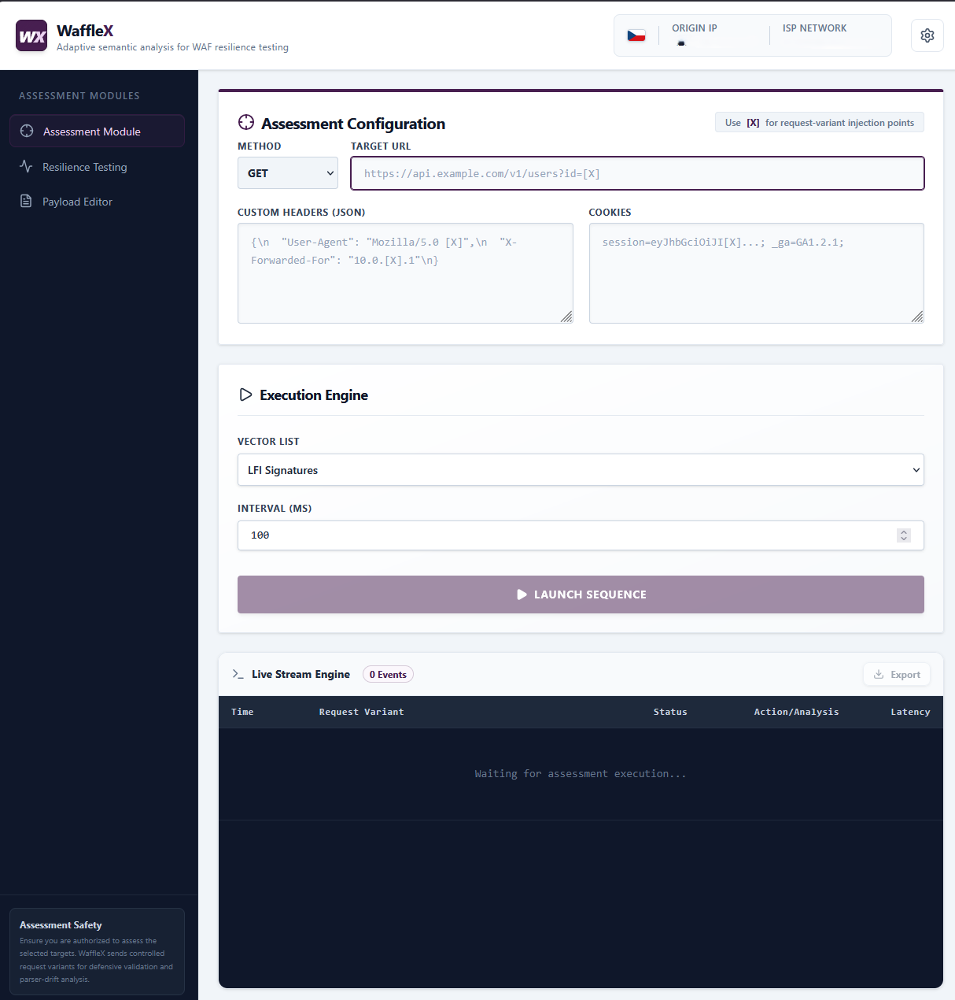
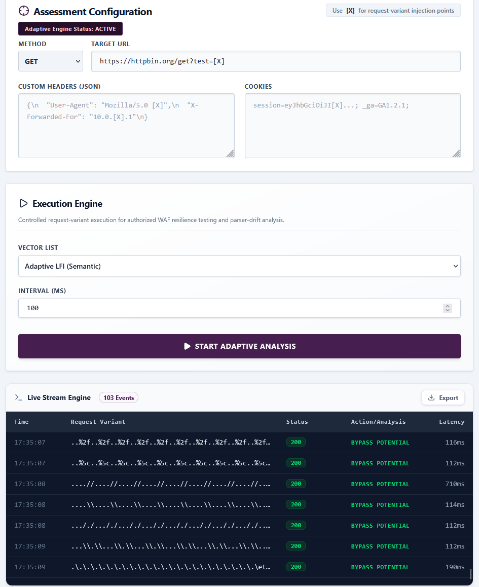
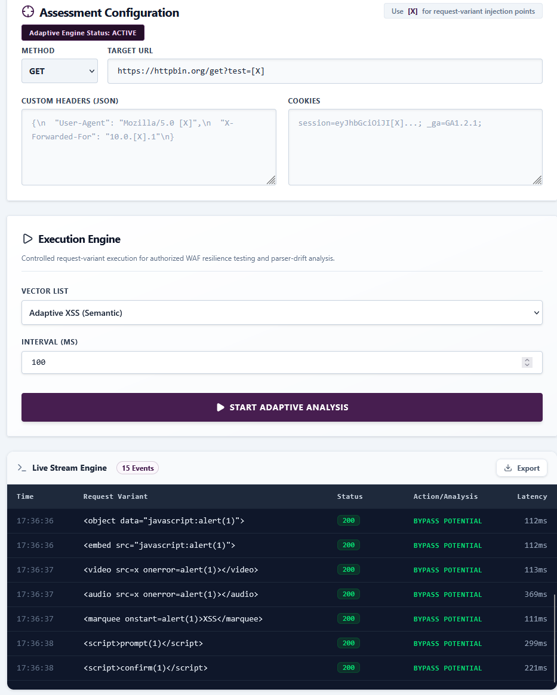

# WaffleX

**Adaptive semantic analysis for WAF resilience testing**

WaffleX is a research prototype designed to evaluate Web Application Firewall (WAF) resilience by executing controlled request variants and analyzing response behavior.

The tool focuses on identifying normalization gaps, parser inconsistencies, and enforcement drift across modern web delivery stacks (e.g., CDN → reverse proxy → WAF → application).

---

## Current Status

This repository contains a working prototype used for demonstration and evaluation.

It is intended for:

- Authorized security assessments
- Defensive validation of WAF and reverse proxy behavior
- Parser-drift analysis
- Controlled lab testing and research

This is **not a production tool**.

---

## Repository Structure

```
wafflex/
├── backend/        # Node.js (Express) API
├── frontend/       # React (Vite) UI
├── docs/           # Architecture notes
├── screenshots/    # Demo images
├── README.md
├── LICENSE
└── .gitignore
```

---

## Features (Prototype)

- Request mutation and injection engine
- Injection points:
  - URL parameters
  - Headers
  - Cookies
  - Request body
- Payload corpus management (LFI, XSS, etc.)
- Real-time execution logs
- Response analysis:
  - HTTP status codes
  - Latency measurements
- Detection heuristics:
  - **BYPASS POTENTIAL** → unexpected 200 responses
  - **ANOMALY** → timing deviations
- Optional proxy routing support

---

## How It Works

1. Define a target with an injection marker:

```
https://target.com/page?input=[X]
```

2. WaffleX replaces `[X]` with payloads  
3. Requests are sent via backend  
4. Responses are analyzed  
5. Results are streamed to UI  

---

## Quick Start

### 1. Backend

```
cd backend
npm install
node server.js
```

Runs on:
```
http://localhost:3001
```

---

### 2. Frontend

```
cd frontend
npm install
npm run dev
```

Runs on default Vite port (usually 5173)

---

## API Overview

- `GET /api/health` → health check  
- `POST /api/check-ip` → check outgoing IP (proxy aware)  
- `POST /api/proxy` → send request with payload  
- `GET /api/payloads` → list payload files  
- `GET /api/payloads/:file` → read payload file  
- `PUT /api/payloads/:file` → update payload file  

---

## Example

Target:

```
https://httpbin.org/get?test=[X]
```

Payload:

```
../../../../etc/passwd
```

WaffleX sends variations and evaluates response behavior.

---

## Demo Screenshots

### UI Overview


### LFI Test Example


### XSS Test Example


---

## Safety Notice

WaffleX must only be used:

- On systems you own, or
- Where you have explicit authorization

Do **not** use this tool for unauthorized testing.

---

## Reviewer Notes (Black Hat Arsenal)

This repository contains a functional prototype including:

- Working frontend and backend
- Payload execution engine
- Response analysis logic
- Demonstration-ready UI

The goal is to demonstrate:

- parser inconsistencies
- enforcement gaps
- behavioral differences in layered defenses

---

## License

MIT
